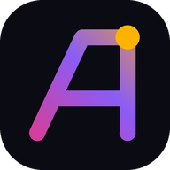
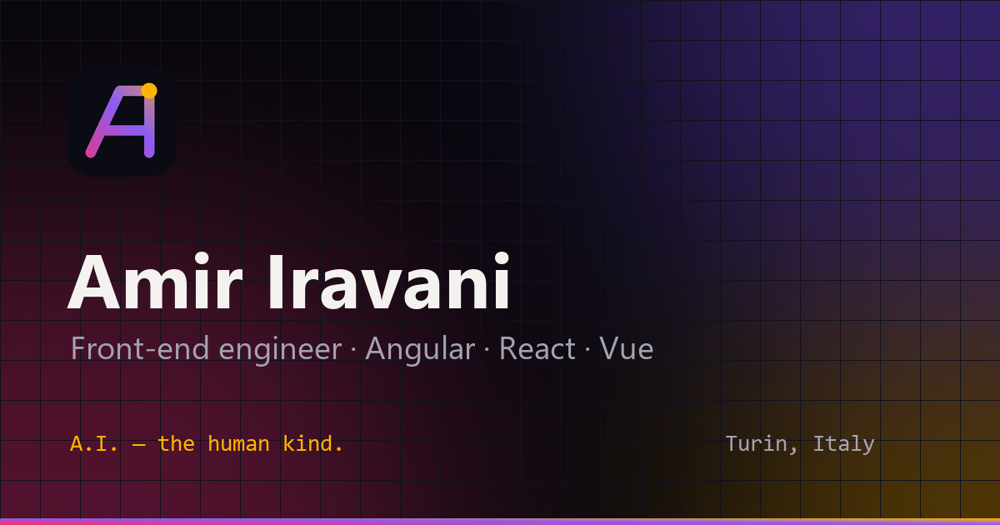

<div align="center">



# Amir Iravani — Portfolio

**A.I. — the human kind.**

The personal site of Amir Mohammad Iravani, front-end engineer (Angular · React · Vue) in Turin, Italy.<br/>
Built with **Angular 22**: zoneless, signals everywhere, in **English, Italiano and فارسی** with full RTL.

[**Live site →**](https://amir-iravani.it/) &nbsp;·&nbsp;
[LinkedIn](https://www.linkedin.com/in/amirmohammad-iravani/) &nbsp;·&nbsp;
[Email](mailto:amirmohammad76@yahoo.com)



</div>

---

## What makes it different

| Feature | What it does | Where |
| --- | --- | --- |
| **Signal graph** | The skills section is a live dependency graph, like Angular signals. Pick a skill and its "signal" flows to every role that used it in production, with total time-in-production computed from CV dates. | [`sections/skills`](src/app/sections/skills) |
| **`git log --graph` career** | Thirteen years of work as a commit history: a `tehran` branch merging into `turin` in 2022, deterministic commit hashes, expandable commits. | [`sections/experience`](src/app/sections/experience) |
| **Particle monogram** | Hundreds of canvas particles fly in to assemble the logo and scatter away from the cursor. Pauses off-screen; static under reduced motion. | [`sections/hero`](src/app/sections/hero) |
| **Halftone portrait** | The photo is redrawn as brand-coloured halftone dots from its luminance, and "develops" into the real photo on hover. | [`sections/about`](src/app/sections/about) |
| **Command palette** | <kbd>Ctrl</kbd>/<kbd>⌘</kbd> + <kbd>K</kbd> (or <kbd>/</kbd>): fuzzy search over sections, actions and links. | [`layout/command-palette.ts`](src/app/layout/command-palette.ts) |
| **Terminal** | Press <kbd>`</kbd> for a working shell: `help`, `whoami`, `experience`, `goto`, `lang fa`, tab completion, history… and `sudo hire-amir`. | [`layout/terminal`](src/app/layout/terminal) |
| **Three languages, one URL** | Runtime EN / IT / FA switching with no reload, `dir="rtl"` for Persian, Persian digits, Gregorian dates to match the CV. | [`core/i18n.service.ts`](src/app/core/i18n.service.ts) |
| **Prints as a CV** | <kbd>Ctrl</kbd> + <kbd>P</kbd> turns the site into a clean one-column A4 résumé. | [`src/_print.scss`](src/_print.scss) |
| **Generative covers** | Each project cover is seeded art made from the project's own palette, so it is identical on every visit. | [`project-cover.ts`](src/app/sections/projects/project-cover.ts) |

Also included: dark and light themes, scroll-spy navigation, reveal-on-scroll, 3D tilt cards, a `mailto:` contact composer (no backend, no tracking), Open Graph and JSON-LD, a PWA manifest, and a greeting in DevTools.

## Tech stack

- **Angular 22**: standalone components, zoneless change detection, signals (`signal`, `computed`, `effect`, `input`), built-in control flow (`@if`, `@for`, `@switch`, `@let`), `OnPush` everywhere
- **TypeScript** in strict mode
- **SCSS** with design tokens as CSS custom properties
- **Vitest** + jsdom through `@angular/build:unit-test`
- **No runtime dependencies** beyond Angular: no UI kit, animation library or icon font
- **GitHub Actions → GitHub Pages** for CI/CD

Initial bundle: **≈ 93 KB** transferred (JS + CSS, gzip).

## Quick start

```bash
npm install
npm start            # http://localhost:4200
npm test             # unit tests (Vitest)
npm run build        # production build → dist/amir-iravani-portfolio/browser
```

Requires Node.js 22.13+ (24 recommended).

## Project structure

```
src/
├── index.html                # SEO meta, Open Graph, JSON-LD, theme bootstrap
├── styles.scss               # design tokens, themes, shared utilities
├── _print.scss               # print-as-CV stylesheet
├── test-setup.ts             # jsdom shims for tests
└── app/
    ├── app.ts / app.html     # shell + global keyboard shortcuts
    ├── core/                 # services & pure helpers (i18n, theme, scroll, dates, models)
    ├── data/
    │   ├── profile.ts        # ← all career content (CV data, projects, skills)
    │   └── ui.ts             # ← all interface copy in EN / IT / FA
    ├── layout/               # nav, footer, command palette, terminal
    ├── sections/             # hero, about, skills, experience, projects, education, contact
    └── shared/               # logo, icons, reveal & tilt directives, clipboard
public/                       # favicon, PWA icons, OG image, portrait, robots, sitemap
tools/generate-assets.py      # regenerates every raster brand asset from code
docs/                         # architecture, content guide, deployment, brand
```

## Documentation

| Doc | For |
| --- | --- |
| [Architecture](docs/ARCHITECTURE.md) | How state, i18n, rendering and the interactive pieces fit together |
| [Editing content](docs/CONTENT.md) | Adding a job, a project, a skill or a translation |
| [Deployment](docs/DEPLOYMENT.md) | cPanel host via the `deploy` branch, GitHub Pages mirror, daily projects |
| [Brand](docs/BRAND.md) | The Ai monogram, palette, typography and asset generation |
| [راهنمای فارسی](docs/README.fa.md) | A short Persian guide for day-to-day updates |
| [Changelog](CHANGELOG.md) | Release notes |

## Accessibility

- Semantic landmarks, a skip link and a single `h1`; every section is labelled by its heading
- Fully keyboard-operable: palette and terminal are native `<dialog>`s with focus management
- Every animation respects `prefers-reduced-motion`
- Visible focus rings, `aria-pressed` / `aria-expanded` on toggles, live regions for dynamic readouts
- Colour tokens tuned for contrast in both themes

## License

Code: [MIT](LICENSE). Personal content (text, photo, CV data and the Ai monogram) © Amir Mohammad Iravani. Please don't reuse it as your own.
