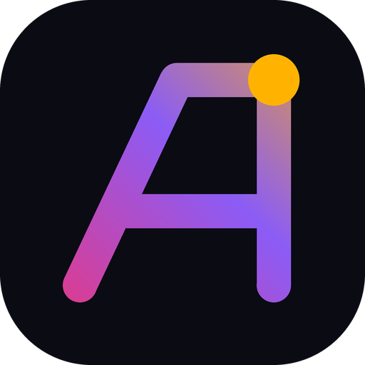

# Brand



## The Ai monogram

**A**mir **I**ravani → **A.I.** The mark is a single continuous gesture: the left stroke of an **A** climbs to the apex, runs flat into the stem of an **i**, and the i's dot is a rising **sun**, a nod to Persian heritage. The tagline follows from it: *A.I. — the human kind.*

Geometry (64-unit viewBox, 6-unit round strokes):

```
M14 50 L31 14 H48     A diagonal + top bar
M48 14 V50            i stem
M22.5 37 H48          crossbar
circle (48,14) r4.5   sun / tittle
```

This geometry is shared by `public/favicon.svg`, `src/app/shared/logo.ts`, the particle sampler in `sections/hero/particle-monogram.ts` and `tools/generate-assets.py`. Change all four together.

## Palette

| Token | Dark | Light | Role |
| --- | --- | --- | --- |
| `--c-rose` | `#FF2E63` | `#E5194F` | Angular-red energy, Turin branch |
| `--c-violet` | `#8B5CF6` | `#6D3FF0` | Midpoint, Tehran branch |
| `--c-sun` | `#FFB300` | `#E09A00` | Sun, highlights, focus |
| `--c-teal` | `#14D3B8` | `#0A9E8A` | Status, "available" |
| `--c-bg` | `#07070C` | `#F6F4EF` | Background |

The brand gradient runs rose → violet (55%) → sun, from bottom-left to top-right.

## Typography

| Use | Latin | Persian |
| --- | --- | --- |
| Display | Unbounded 500–700 | Vazirmatn |
| Text | Inter Tight 400–700 | Vazirmatn |
| Code / meta | JetBrains Mono | — |

## Regenerating assets

```bash
pip install pillow
python tools/generate-assets.py [portrait.png]
```

This writes `favicon.ico`, `apple-touch-icon.png`, the PWA icons (including a maskable icon), the 1200×630 `og-image.png` and, when a portrait is given, `images/amir-iravani.{webp,jpg}`.
